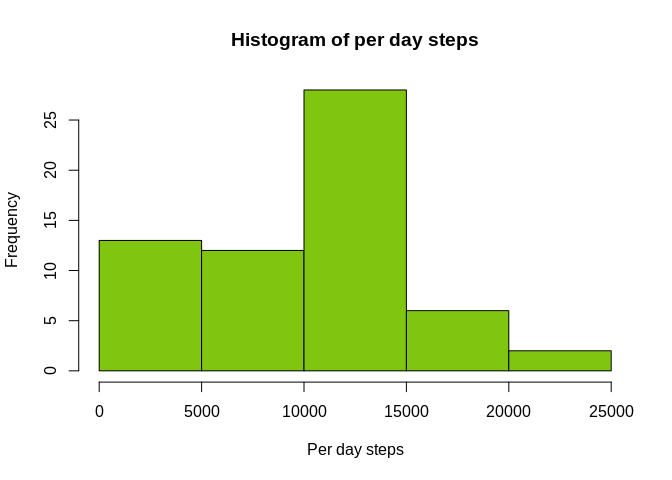
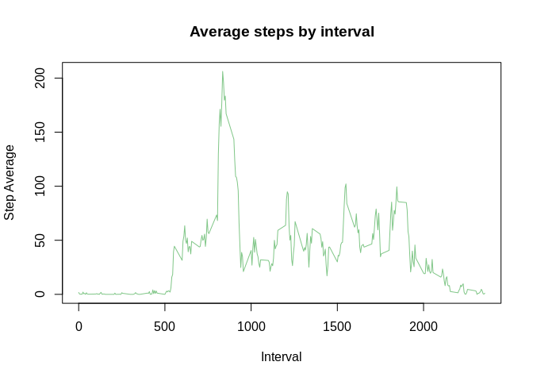
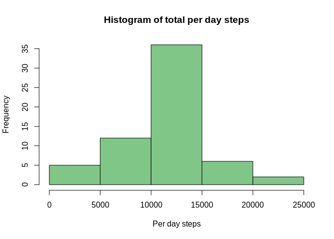
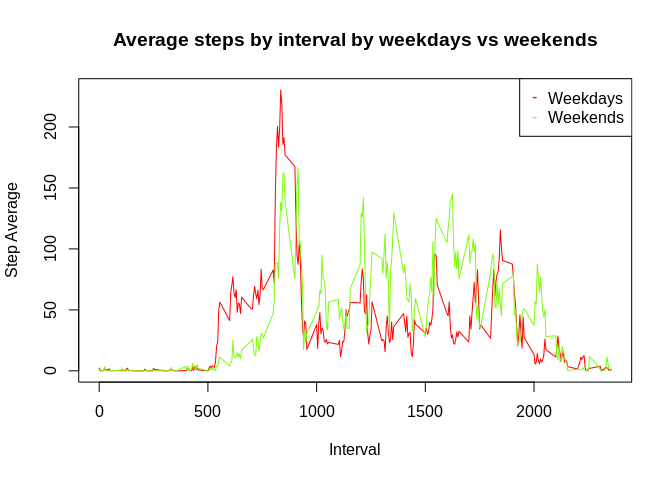

## Loading and preprocessing the data


```r
file <- "https://d396qusza40orc.cloudfront.net/repdata%2Fdata%2Factivity.zip"

if (!file.exists(file)){
        file <- "https://d396qusza40orc.cloudfront.net/repdata%2Fdata%2Factivity.zip"
        download.file(file, "Tarea2.csv", method="curl")
}  

if (!file.exists("activity.csv")) { 
        unzip(file) 
}

activity <- read.csv("activity.csv")

head(activity)
```

```
##   steps       date interval
## 1    NA 2012-10-01        0
## 2    NA 2012-10-01        5
## 3    NA 2012-10-01       10
## 4    NA 2012-10-01       15
## 5    NA 2012-10-01       20
## 6    NA 2012-10-01       25
```


## What is mean total number of steps taken per day?

Now we will calculate the total per day steps by summing the steps in each interval.
Next a histogram of this data is show


```r
total.per.day <- activity %>% group_by(date) %>% summarise(total = sum(steps, na.rm = TRUE))

hist(total.per.day$total, main="Histogram of per day steps", xlab="Per day steps", col = "#80C610")
```

<!-- -->

Having this information it will be calculated the mean and median of the total steps per day.
The mean is:


```r
media <- mean(total.per.day$total)
print(media)
```

```
## [1] 9354.23
```


The median es:


```r
mediana <- median(total.per.day$total)
print(mediana)
```

```
## [1] 10395
```


## What is the average daily activity pattern?

Next we will calculate the mean per interval of 5 minutes. 


```r
mean.per.interval <- activity %>% group_by(interval) %>% summarise(average = mean(steps, na.rm = TRUE))

plot(mean.per.interval, type = "l", main="Average steps by interval", xlab="Interval", ylab="Step Average", col = "#80C687")
```

<!-- -->

The maximum average of steps is in the interval:


```r
max.average <- which.max(mean.per.interval$average)

mean.per.interval$interval[max.average] 
```

```
## [1] 835
```

## Imputing missing values

The number of NA's in the steps variable is:


```r
n.na <- sum(is.na(activity$steps))

print(n.na)
```

```
## [1] 2304
```

For imputing values to NA we create a new data.frame call full.activity


```r
full.activity <- activity
```

Now we make a function that imputs the mean of the interval 


```r
for (i in 1:length(full.activity$steps)){
        if(is.na(full.activity$steps[i])){
                full.activity$steps[i]<-mean.per.interval$average[full.activity$interval[i]==mean.per.interval$interval]
        }
}
```

We check that there is no more missing values.


```r
sum(is.na(full.activity$steps))
```

```
## [1] 0
```

With this new data frame we recalculate the total number of steps and make and histogram of this


```r
full.total.per.day <- full.activity %>% group_by(date) %>% summarise(total = sum(steps, na.rm = TRUE))

hist(full.total.per.day$total, col = "#80C687", main = "Histogram of total per day steps", xlab = "Per day steps")
```

<!-- -->

Next we can see the mean of the imput data frame:


```r
full.media <- mean(full.total.per.day$total)
print(full.media)
```

```
## [1] 10766.19
```

The diference between the mean of the non imput with the imput data frame is:


```r
dif.mean <- media - full.media
print(dif.mean)
```

```
## [1] -1411.959
```

The median of the imput data frame is:


```r
full.mediana <- median(full.total.per.day$total)
print(full.mediana)
```

```
## [1] 10766.19
```

The diference between the median of the non imput with the imput data frame is:


```r
dif.median <- mediana - full.mediana
print(dif.median)
```

```
## [1] -371.1887
```

The imput generetes a disminution of the mean and median.

## Are there differences in activity patterns between weekdays and weekends?

Next it is created a new variable call clas.days that contains the option "weekday" or "weekend" depending the day of the week


```r
full.activity$days<-weekdays(as.Date(full.activity$date))

full.activity$clas.days[full.activity$days=="lunes"]<-"Weekday"
full.activity$clas.days[full.activity$days=="martes"]<-"Weekday"
full.activity$clas.days[full.activity$days=="miércoles"]<-"Weekday"
full.activity$clas.days[full.activity$days=="jueves"]<-"Weekday"
full.activity$clas.days[full.activity$days=="viernes"]<-"Weekday"
full.activity$clas.days[full.activity$days=="sábado"]<-"Weekend"
full.activity$clas.days[full.activity$days=="domingo"]<-"Weekend"
```

It is calculated the mean per clas.days and interval


```r
full.mean.per.interval <- full.activity %>% group_by(clas.days, interval) %>% summarise(average = mean(steps, na.rm = TRUE))
```

Last, we make a plot of the average steps by interval to see weekdays vs weekends


```r
par(mfrow=c(1,1))

plot(full.mean.per.interval$average[full.mean.per.interval$clas.days=="Weekday"] ~ full.mean.per.interval$interval[full.mean.per.interval$clas.days=="Weekday"], type = "l", main="Average steps by interval by weekdays vs weekends", xlab="Interval", ylab="Step Average", col = "#FF0000")

lines(full.mean.per.interval$average[full.mean.per.interval$clas.days=="Weekend"]  ~ full.mean.per.interval$interval[full.mean.per.interval$clas.days=="Weekend"], type = "l", col = "#80FA10")

legend("topright",pch="--",  col = c("#FF0000", "#80FA10"), legend = c("Weekdays", "Weekends"))
```

<!-- -->


